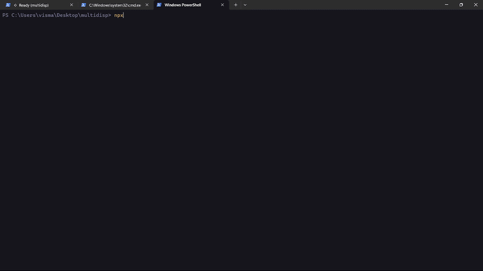

<p align="center">
  
</p>

<h1 align="center">Fullerenes</h1>

<p align="center">
  Persistent local memory for AI coding agents.
</p>

<p align="center">
  <a href="https://www.npmjs.com/package/fullerenes"></a>
  <a href="https://www.npmjs.com/package/fullerenes"></a>
  <a href="https://github.com/codebreaker77/Fullerenes/stargazers"></a>
  <a href="https://github.com/codebreaker77/Fullerenes"></a>
  <a href="https://ko-fi.com/U7U31YJNBN"></a>
</p>

Fullerenes turns a source tree into a local knowledge graph that agents can query instead of repeatedly rebuilding context from raw files. It helps coding agents find the right files, the right symbols, the right callers, and the likely blast radius before editing.

## Why Fullerenes

Large codebases punish naive prompting.

Most agents waste tokens by:
- scanning too many files
- missing the real entry points
- guessing caller relationships
- losing context between sessions

Fullerenes fixes that by giving the agent a local graph-backed memory layer with:
- targeted code retrieval
- caller and impact inspection
- MCP access for coding agents
- watch mode to keep context fresh
- generated `AGENTS.md`, `CLAUDE.md`, and Cursor rules

## What You Get

This OSS repo ships three packages:

- `fullerenes`
  Local-first CLI, MCP server, and agent-context file generation
- `fullerenes-core`
  Parser engine, SQLite graph storage, incremental indexer, and query layer
- `fullerenes-daemon`
  File watcher and auto-reindex daemon

## What's New

This release tightens Fullerenes in a few important ways:
- fully local-first generated summaries with no external LLM dependency
- stronger natural-language retrieval in the graph query path
- smaller, more targeted query outputs to reduce token usage
- improved agent instructions in generated `AGENTS.md` and `CLAUDE.md`
- cleaner CLI / MCP / daemon version alignment
- polished GitHub and npm docs

## Quick Demo

<p align="center">
  
</p>

## Install

```bash
npm install -g fullerenes
```

Or run it without a global install:

```bash
npx fullerenes init
```

If you are working from source in this repo:

```bash
npm install
npm run build
node packages/cli/dist/cli.js init .
```

## Quick Start

### 1. Index a repository

Run Fullerenes at the root of a project:

```bash
npx fullerenes init
```

This creates:
- `.fullerenes/graph.db`
- `CLAUDE.md`
- `AGENTS.md`
- `.cursor/rules/fullerenes.mdc`

`CLAUDE.md` and `AGENTS.md` preserve user-written content outside the Fullerenes-managed block.

### 2. Ask questions about the codebase

```bash
npx fullerenes query "how does authentication work"
npx fullerenes query "where is watch mode implemented" --budget 1200
npx fullerenes stats
```

The query command returns compact graph-grounded context instead of broad file dumps.

### 3. Connect an agent over MCP

Start the local MCP server:

```bash
npx fullerenes mcp .
```

For Claude Code:

```bash
claude mcp add fullerenes -- npx fullerenes mcp .
```

For Codex Desktop or another MCP client, register a stdio MCP server with:

```bash
npx fullerenes mcp /absolute/path/to/project
```

Once connected, the agent can use tools like:
- `query_codebase`
- `get_function`
- `find_entry_points`
- `get_file_context`
- `search_code`
- `get_callers`
- `predict_impact`
- `get_stats`
- `get_subgraph`

### 4. Keep the graph fresh while coding

```bash
npx fullerenes watch .
```

Watch mode listens for file changes, runs incremental reindexing, and refreshes generated agent files when the graph changes enough to matter.

## Example Workflows

### Find the implementation and fetch the body when needed

```text
get_function({ name: "resetCache", includeBody: true })
```

### Estimate blast radius before editing

```text
predict_impact({ functionName: "resetCache" })
```

### Ask a repo-level question with a token budget

```text
query_codebase({ question: "how does indexing flow work", maxTokens: 1600 })
```

## Why This Matters For Agents

Agents are usually good at editing code once they know where to look.

They are bad at:
- rebuilding repo structure from scratch
- deciding which files are actually relevant
- tracing callers and dependents efficiently
- preserving a compact working memory across sessions

Fullerenes is the layer that gets the agent to the right code fast.

## Benchmark

Local benchmark on this repository using Fullerenes output vs concatenating the source files touched by the returned subgraph:

| Scenario | Estimated tokens |
| --- | ---: |
| Raw file context | 2452 |
| Fullerenes query result | 137 |
| Reduction | 94.4% fewer tokens |

Methodology notes:
- token estimate uses the project heuristic `1 token ~= 4 characters`
- benchmark questions were run against this repo's local graph

## Comparison

| Capability | Fullerenes OSS | Raw file prompting | Generic graph tooling |
| --- | --- | --- | --- |
| Works offline | Yes | Yes | Varies |
| Zero hosted infra required | Yes | Yes | Varies |
| Token-budgeted query output | Yes | No | Rare |
| MCP server for agents | Yes | No | Varies |
| Caller and impact inspection | Yes | No | Varies |
| Local SQLite graph | Yes | No | Varies |

## Core CLI Commands

- `fullerenes init [path]`
- `fullerenes index [path]`
- `fullerenes query "<question>" [--budget <tokens>] [--json]`
- `fullerenes stats [path]`
- `fullerenes mcp [path]`
- `fullerenes watch [path]`

## Repository Layout

```text
Fullerenes/
|- assets/
|  `- readme/
|- packages/
|  |- cli/
|  |- core/
|  `- daemon/
|- package.json
|- turbo.json
`- tsconfig.base.json
```

## Development

```bash
npm install
npm run build
npm run test
npm run lint
```

## Publish Order

Publish in this order:

1. `fullerenes-core`
2. `fullerenes-daemon`
3. `fullerenes`

Full release steps are documented in [PUBLISHING.md](./PUBLISHING.md).

## Contributing

Contribution notes are in [CONTRIBUTING.md](./CONTRIBUTING.md).

## License

MIT
